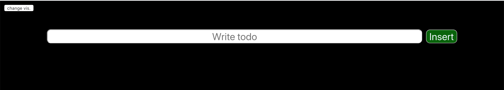
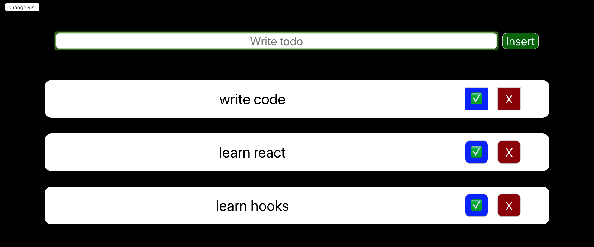
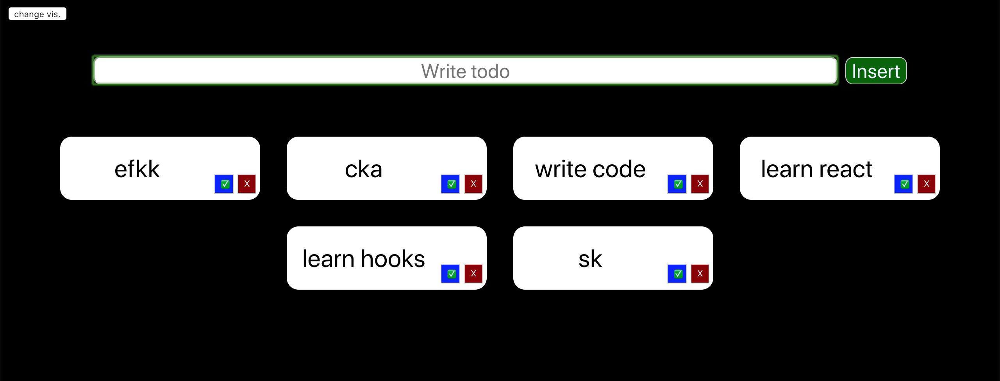
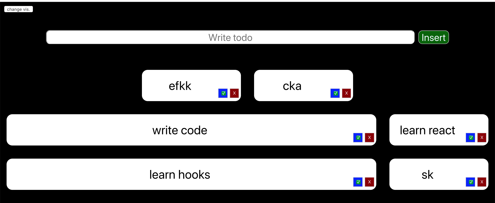

# Simple Todo app with React and Hooks
## This is a very simple todo app made with react and the most simple hooks, use State.

## the button on left-top is for change the display modality of todos

- Here the todos are clickable to expand them 

- It's just a simple project to start with!
- Feel free to use this code if you like!

